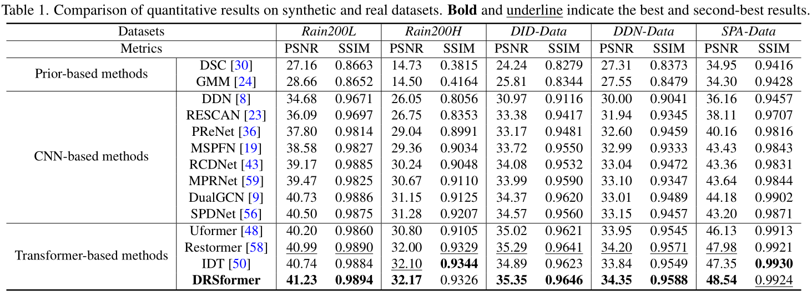

# Learning A Sparse Transformer Network for Effective Image Deraining (CVPR 2023)

[Xiang Chen](https://cschenxiang.github.io/), [Hao Li](https://house-leo.github.io/), Mingqiang Li, and [Jinshan Pan](https://jspan.github.io/)

[Paper Download]([https://arxiv.org/abs/2305.08824](https://openaccess.thecvf.com/content/CVPR2023/html/Chen_Learning_a_Sparse_Transformer_Network_for_Effective_Image_Deraining_CVPR_2023_paper.html))

<hr />

> **Abstract:** *Transformers-based methods have achieved significant performance in image deraining as they can model the non-local information which is vital for high-quality image reconstruction. In this paper, we find that most existing Transformers usually use all similarities of the tokens from the query-key pairs for the feature aggregation. However, if the tokens from the query are different from those of the key, the self-attention values estimated from these tokens also involve in feature aggregation, which accordingly interferes with the clear image restoration. To overcome this problem, we propose an effective DeRaining network, Sparse Transformer (DRSformer) that can adaptively keep the most useful self-attention values for feature aggregation so that the aggregated features better facilitate high-quality image reconstruction. Specifically, we develop a learnable top-k selection operator to adaptively retain the most crucial attention scores from the keys for each query for better feature aggregation. Simultaneously, as the naive feed-forward network in Transformers does not model the multi-scale information that is important for latent clear image restoration, we develop an effective mixed-scale feed-forward network to generate better features for image deraining. To learn an enriched set of hybrid features, which combines local context from CNN operators, we equip our model with mixture of experts feature compensator to present a cooperation refinement deraining scheme. Extensive experimental results on the commonly used benchmarks demonstrate that the proposed method achieves favorable performance against state-of-the-art approaches. The source codes are available at https://github.com/cschenxiang/DRSformer.*
<hr />

## Network Architecture


## Datasets
<table>
<thead>
  <tr>
    <th>Dataset</th>
    <th>Rain200L</th>
    <th>Rain200H</th>
    <th>DID-Data</th>
    <th>DDN-Data</th>
    <th>SPA-Data</th>
  </tr>
</thead>
<tbody>
  <tr>
    <td>Baidu Cloud</td>
    <td> <a href="https://pan.baidu.com/s/1rTb4qU3fCEA4MRpQss__DA?pwd=s2yx">Download</a> </td>
    <td> <a href="https://pan.baidu.com/s/1KK8R2bPKgcOX8gMXSuKtCQ?pwd=z9br">Download</a> </td>
    <td> <a href="https://pan.baidu.com/s/1aPFJExxxTBOzJjngMAOQDA?pwd=5luo">Download</a> </td>
    <td> <a href="https://pan.baidu.com/s/1g_m7RfSUJUtknlWugO1nrw?pwd=ldzo">Download</a> </td>
    <td> <a href="https://pan.baidu.com/s/1YfxC5OvgYcQCffEttFz8Kg?pwd=yjow">Download</a> </td>
  </tr>
</tbody>
</table>
Here, these datasets we provided are fully paired images, especially SPA-Data. 

## Training
1. Please download the corresponding training datasets and put them in the folder `Datasets/train`. Download the testing datasets and put them in the folder `Datasets/test`. 
2. Note that we do not use MEFC for training Rain200L and SPA-Data, because their rain streaks are less complex and easier to learn. Please modify the file `DRSformer_arch.py`.
3. Follow the instructions below to begin training our model.
```
cd DRSformer
bash train.sh
```
Run the script then you can find the generated experimental logs in the folder `experiments`.

## Testing
1. Please download the corresponding testing datasets and put them in the folder `test/input`. Download the corresponding pre-trained models and put them in the folder `pretrained_models`.
2. Note that we do not use MEFC for training Rain200L and SPA-Data, because their rain streaks are less complex and easier to learn. Please modify the file `DRSformer_arch.py`.
3. Follow the instructions below to begin testing our model.
```
python test.py --task Deraining --input_dir './test/input/' --result_dir './test/output/'
```
Run the script then you can find the output visual results in the folder `test/output/Deraining`.

## Pre-trained Models
<table>
<thead>
  <tr>
    <th>Dataset</th>
    <th>Rain200L</th>
    <th>Rain200H</th>
    <th>DID-Data</th>
    <th>DDN-Data</th>
    <th>SPA-Data</th>
  </tr>
</thead>
<tbody>
  <tr>
    <td>Baidu Cloud</td>
    <td> <a href="https://pan.baidu.com/s/1uj7TWVr4Ys00Xfc8i-AquQ?pwd=kzj5">Download</a> </td>
    <td> <a href="https://pan.baidu.com/s/1paqtkKfdjLGetnRVhDb6LQ?pwd=j10m">Download</a> </td>
    <td> <a href="https://pan.baidu.com/s/1xSS5N5gUkpQ_Jl8MUz6wlw?pwd=nact">Download</a> </td>
    <td> <a href="https://pan.baidu.com/s/1RKG-Eel29lgi0nHwdk2JIw?pwd=hj6r">Download</a> </td>
    <td> <a href="https://pan.baidu.com/s/1Jp5sAsFFmJmko7ZwHdKmxQ?pwd=vfvt">Download</a> </td>
  </tr>
</tbody>
<tbody>
  <tr>
    <td>Google Drive</td>
    <td> <a href="https://drive.google.com/file/d/1Mm6hWdpjo9eEoNlCHAxd03etY3ks-zyy/view?usp=sharing">Download</a> </td>
    <td> <a href="https://drive.google.com/file/d/1mt8ydHE540_qtytger4dVcv6xqZ5YMhh/view?usp=sharing">Download</a> </td>
    <td> <a href="https://drive.google.com/file/d/1U_UEGPhYRJ-G10-Dypr7FbwDRGmroAHC/view?usp=sharing">Download</a> </td>
    <td> <a href="https://drive.google.com/file/d/1kwPOfufdUf9bCZ-OvwIziw-6ZRdcT2RX/view?usp=sharing">Download</a> </td>
    <td> <a href="https://drive.google.com/file/d/1i33Zmb1YXdLcalJOIP7YTegjnuTsVcC1/view?usp=sharing">Download</a> </td>
  </tr>
</tbody>
</table>

## Performance Evaluation
See folder "evaluations" 

1) *for Rain200L/H and SPA-Data datasets*: 
PSNR and SSIM results are computed by using this [Matlab Code](https://github.com/swz30/Restormer/blob/main/Deraining/evaluate_PSNR_SSIM.m).

2) *for DID-Data and DDN-Data datasets*: 
PSNR and SSIM results are computed by using this [Matlab Code](https://github.com/hongwang01/RCDNet/tree/master/Performance_evaluation).



Please note that Table 1 above is our final camera-ready version. There exists the slight gap between the final version and the arXiv version due to errors caused by different testing devices and environments. It is recommended that you can download the visual deraining results and retest the quantitative results on your own device and environment.

## Visual Deraining Results
<table>
<thead>
  <tr>
    <th>Dataset</th>
    <th>Rain200L</th>
    <th>Rain200H</th>
    <th>DID-Data</th>
    <th>DDN-Data</th>
    <th>SPA-Data</th>
  </tr>
</thead>
<tbody>
  <tr>
    <td>DualGCN</td>
    <td> <a href="https://pan.baidu.com/s/1o9eLMv7Zfk_GC9F4eWC2kw?pwd=v8qy">Download</a> </td>
    <td> <a href="https://pan.baidu.com/s/1QiKh5fTV-QSdnwMsZdDe9Q?pwd=jnc9">Download</a> </td>
    <td> <a href="https://pan.baidu.com/s/1Wh7eJdOwXPABz5aOBPDHaA?pwd=3gdx">Download</a> </td>
    <td> <a href="https://pan.baidu.com/s/1ML1A1boxwX38TGccTzr6KA?pwd=1mdx">Download</a> </td>
    <td> <a href="https://pan.baidu.com/s/16RHVyrBoPnOhW1QuglRmlw?pwd=lkeb">Download</a> </td>
  </tr>
  <tr>
    <td>SPDNet</td>
    <td> <a href="https://pan.baidu.com/s/1u9F4IxA8GCxKGk6__W81Og?pwd=y39h">Download</a> </td>
    <td> <a href="https://pan.baidu.com/s/1wSTwW6ewBUgNLj7l7i6HzQ?pwd=mry2">Download</a> </td>
    <td> <a href="https://pan.baidu.com/s/1z3b60LHOyi8MLcn8fdNc8A?pwd=klci">Download</a> </td>
    <td> <a href="https://pan.baidu.com/s/130e74ISgZtlaw8w6ZzJgvQ?pwd=19bm">Download</a> </td>
    <td> <a href="https://pan.baidu.com/s/1J0ybwnuT__ZGQZNbMTfw8Q?pwd=dd98">Download</a> </td>
  </tr>
  <tr>
    <td>Uformer</td>
    <td> - </td>
    <td> - </td>
    <td> <a href="https://pan.baidu.com/s/1fWLjSCSaewz1QXdddkpkIw?pwd=4uur">Download</a> </td>
    <td> <a href="https://pan.baidu.com/s/1cWY7piDJRF05qKYPNXt_cA?pwd=39bj">Download</a> </td>
    <td> - </td>
  </tr>
  <tr>
    <td>Restormer</td>
    <td> <a href="https://pan.baidu.com/s/1jv6PUMO7h_Tc4ovrCLQsSw?pwd=6a2z">Download</a> </td>
    <td> <a href="https://pan.baidu.com/s/16R0YamX-mfn6j9sYP7QpvA?pwd=9m1r">Download</a> </td>
    <td> <a href="https://pan.baidu.com/s/1b8lrKE82wgM8RiYaMI6ZQA?pwd=1hql">Download</a> </td>
    <td> <a href="https://pan.baidu.com/s/1GGqsfUOdoxod9vAUxB54PA?pwd=crj4">Download</a> </td>
    <td> <a href="https://pan.baidu.com/s/1IG4T1Bz--FrDAuV6o-fykA?pwd=b40z">Download</a> </td>
  </tr>
  <tr>
    <td>IDT</td>
    <td> <a href="https://pan.baidu.com/s/1jhHCHT64aDknc4g0ELZJGA?pwd=v4yd">Download</a> </td>
    <td> <a href="https://pan.baidu.com/s/10TZzZH0HisPV0Mw-E4SlTQ?pwd=77i4">Download</a> </td>
    <td> <a href="https://pan.baidu.com/s/1svMZAUvs6P6RRNGyCTaeAA?pwd=8uxx">Download</a> </td>
    <td> <a href="https://pan.baidu.com/s/1FSf3-9HEIQ-lLGRWesyszQ?pwd=0ey6">Download</a> </td>
    <td> <a href="https://pan.baidu.com/s/16hfo5VeUhzu6NYdcgf7-bg?pwd=b862">Download</a> </td>
  </tr>
  <tr>
    <td>Ours</td>
    <td> <a href="https://pan.baidu.com/s/1-ElpyJigVnpt5xDFE6Pqqw?pwd=hyuv">Download</a> </td>
    <td> <a href="https://pan.baidu.com/s/13aJKxH7V_6CIAynbkHXIyQ?pwd=px2j">Download</a> </td>
    <td> <a href="https://pan.baidu.com/s/1Xl3q05rZYmNEtQp5eLTTKw?pwd=t879">Download</a> </td>
    <td> <a href="https://pan.baidu.com/s/1D36Z0cEVPPbm5NljV-8yoA?pwd=9vtz">Download</a> </td>
    <td> <a href="https://pan.baidu.com/s/1Rc36xXlfaIyx3s2gqUg_Bg?pwd=bl4n">Download</a> </td>
  </tr>
</tbody>
</table>

For DualGCN, SPDNet, Restormer and IDT, we retrain their models provided by the authors if no pretrained models are provided, otherwise we evaluate them with their online codes. For Uformer, we refer to some reported results in [IDT](https://github.com/jiexiaou/IDT). Noted that since the PSNR/SIMM codes used to test DID-Data and DDN-Data in their paper are different from ours, we retrain the Uformer on the DID-Data and DDN-Data. For other previous methods, we refer to reported results in [here](https://ieeexplore.ieee.org/document/10035447/) with same PSNR/SIMM codes.

## More Results
<table>
<thead>
  <tr>
    <th>Dataset</th>
    <th>PSNR / SSIM</th>
    <th>Models</th>
    <th>Results</th>
  </tr>
</thead>
<tbody>
  <tr>
    <td>Rain100L</td>
    <td> 42.49 / 0.9904 </td>
    <td> <a href="https://drive.google.com/file/d/1EgMPccXCyaihI4pThYdyo18V3wf6i7rV/view?usp=sharing">Download</a> </td>
    <td> <a href="https://pan.baidu.com/s/1zGcWPMTZ8I-U0ffX0qDEHw?pwd=nsuw">Download</a> </td>
  </tr>
</tbody>
<tbody>
  <tr>
    <td>Rain100H</td>
    <td> 33.79 / 0.9375 </td>
    <td> <a href="https://drive.google.com/file/d/1-yBWNUurYazS5P1L-kPxCo7fr1vRvC9V/view?usp=sharing">Download</a> </td>
    <td> <a href="https://pan.baidu.com/s/1RZO5woGLbKR5H1kqJbXGFw?pwd=jbh4">Download</a> </td>
  </tr>
</tbody>
</table>


## Citation
If you are interested in this work, please consider citing:

    @inproceedings{DRSformer,
        title={Learning A Sparse Transformer Network for Effective Image Deraining}, 
        author={Chen, Xiang and and Li, Hao and Li, Mingqiang and Pan, Jinshan},
        booktitle={Proceedings of the IEEE/CVF Conference on Computer Vision and Pattern Recognition (CVPR)},
        year={2023}
    }

## Acknowledgment
This code is based on the [Restormer](https://github.com/swz30/Restormer). Thanks for their awesome work.

## Contact
Should you have any question or suggestion, please contact chenxiang@njust.edu.cn.
