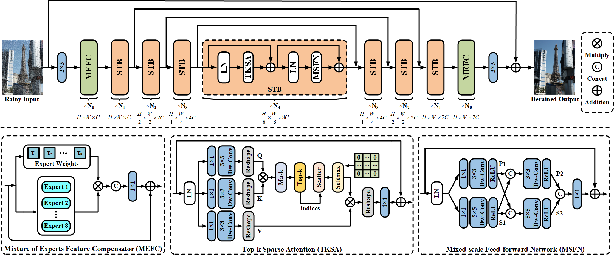

# Learning A Sparse Transformer Network for Effective Image Deraining (CVPR 2023)

[Xiang Chen](https://cschenxiang.github.io/), [Hao Li](https://house-leo.github.io/), Mingqiang Li, and [Jinshan Pan](https://jspan.github.io/)

## Updates
- [2023-03-02] The Arxiv version of this paper will be available at March 20.
- [2023-02-28] This paper will appear in CVPR 2023.  

> **Abstract:** *Transformers have achieved significant decent performance in image deraining as they can better model the non-local information which is vital for high-quality image reconstruction. In this paper, we find that most existing Transformers usually use all similarities of the tokens from the query-key pairs for the feature aggregation. However, if the tokens from the query are different from those of the key, the self-attention values estimated from these tokens also involve in feature aggregation, which accordingly interferes with the clear image restoration. To overcome this problem, we propose an effective deraining network, sparse Transformer (DRSformer) that can adaptively keep the most useful self-attention values for feature aggregation so that the aggregated features better facilitate high-quality image reconstruction. Specifically, we develop a simple yet learnable top-k selection operator to adaptively retain the most crucial attention scores from the keys for each query for better feature aggregation. Simultaneously, as the naive feed-forward network in Transformers does not model the multi-scale information that is important for latent clear image restoration, we develop an effective mixed-scale feed-forward network to generate better features for image deraining. To learn an enriched set of hybrid features that combines local context from CNN operators, we also equip our model with mixture of experts feature compensator to present a cooperation refinement deraining scheme. Extensive experimental results on the commonly used benchmarks demonstrate that the proposed method achieves favorable performance against state-of-the-art approaches. The source codes are available at https://github.com/cschenxiang/DRSformer.*

## Network Architecture

## Datasets
<table>
<thead>
  <tr>
    <th>Dataset</th>
    <th>Rain200L</th>
    <th>Rain200H</th>
    <th>DID-Data</th>
    <th>DDN-Data</th>
    <th>SPA-Data</th>
  </tr>
</thead>
<tbody>
  <tr>
    <td>Train / Test</td>
    <td>1,800 / 200</td>
    <td>1,800 / 200</td>
    <td>12,000 / 1,200</td>
    <td>14,000 / 1,400</td>
    <td>638,492 / 1,000</td> 
  <tr>
    <td>Baidu Cloud</td>
    <td> <a href="https://pan.baidu.com/s/1rTb4qU3fCEA4MRpQss__DA?pwd=s2yx">Baidu Cloud</a> </td>
    <td> <a href="https://pan.baidu.com/s/1KK8R2bPKgcOX8gMXSuKtCQ?pwd=z9br">Baidu Cloud</a> </td>
    <td> <a href="">Baidu Cloud</a> </td>
    <td> <a href="">Baidu Cloud</a> </td>
    <td> <a href="https://pan.baidu.com/s/1YfxC5OvgYcQCffEttFz8Kg?pwd=yjow">Baidu Cloud</a> </td>
  </tr>
</tbody>
</table>

## Performance Evaluation
See folder "evaluations" 

1) *for Rain200L/H and SPA-Data datasets*: 
PSNR and SSIM results are computed by using this [Matlab Code](https://github.com/swz30/Restormer/blob/main/Deraining/evaluate_PSNR_SSIM.m).

2) *for DID-Data and DDN-Data datasets*: 
PSNR and SSIM results are computed by using this [Matlab Code](https://github.com/hongwang01/RCDNet/tree/master/Performance_evaluation).

## Citation
If you are interested in this work, please consider citing:

    @inproceedings{DRSformer,
        title={Learning A Sparse Transformer Network for Effective Image Deraining}, 
        author={Chen, Xiang and and Li, Hao and Li, Mingqiang and Pan, Jinshan},
        booktitle={Proceedings of the IEEE/CVF Conference on Computer Vision and Pattern Recognition (CVPR)},
        year={2023}
    }

## Acknowledgment
This code is based on the [Restormer](https://github.com/swz30/Restormer). Thanks for their awesome work.

## Contact
Should you have any question or suggestion, please contact chenxiang@njust.edu.cn.
